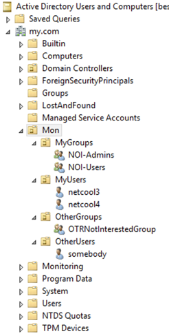
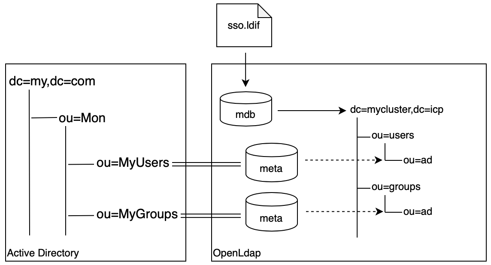
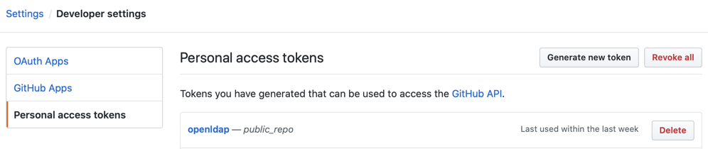

# Configuring OpenLdap container to support any structure of corporate LDAP server

This instruction has been prepared in 2019 for Kubernetes installation of NOI. But the approach of configuring OpenLdap might be applicable for NOI on OCP. Upon request, I'm sharing it with Business Partner.

The instruction is publicly available and can be used by anyone with no limitations.

There is a requirement for NOI v1.6.0 to have certain LDAP structure at the corporate LDAP server: [Creating users on an external LDAP server](https://www.ibm.com/support/knowledgecenter/SSTPTP_1.6.0/com.ibm.netcool_ops.doc/soc/admin/reference/managing_users_using_an_external_ldap_server.html). Following the documentation we need to have groups in `ou=groups,LDAP_SUFFIX` and users in `ou=users,LDAP_SUFFIX` as well as have administrative users like "impactadmin" or "unityadmin" exactly named. Some customers are not ready of the approach and request to have administrative users placed in another LDAP domain or even different LDAP domains and named with their style. Also, they're not ready to change their domain structure because of security automations which already configured for current domain trees.

The instruction is about to make configuration of OpenLadp contaner that comes with cloud NOI to operate in "proxy" mode for corporate domain trees combined in a single virtual structure as well as in the "LDAP domain" mode for keeping administrative users.

## Solution Overview

In the example, we have prototype of customer's LDAP domain with the following structure:



We need to grant access to NOI for users in `ou=MyUsers,ou=Mon,dc=my,dc=com`, according to permissions assigned to their groups from `ou=MyGroups,ou=Mon,dc=my,dc=com`. We will use internal `mdb` database, which is holding the proxy domain `dc=mycluster,dc=icp`. The database is being populated during container startup from `sso.ldif` file. The database will contain limited number of administrative users required for internal NOI communication such as "unityadmin" and "impactadmin":



To have integration with corporate LDAP (Active Directory in our case) we will use several `meta` databases which will proxy AD branches. It is evident we can use as many `meta` databases as we need to glue AD branches into sub-branch of our domain `dc=mycluster,dc=icp`, for example, `ou=ad2,ou=users,dc=mycluster,dc=icp` and `ou=ad3,ou=users,dc=mycluster,dc=icp`. This way we can differentiate users between original sources. In our example we will use virtual organizational units `ou=ad` to glue branches from our prototype AD.

By default, OpenLdap comes with two options/images "proxy" and "standalone", none of them has enough libraries to configure scheme. For example, we will have to use `rwm_suffixmassage` to map relations between users and groups from `rwl.la`, or to use databases of type `meta` from `back_meta.la`. I wasn't able to install all libraries because yum was trying to change /etc and it wasn't succeed, so I've included command to copy these files as an archive and extract them into certain directory. I need to mention that I also had to adjust path for these libraries inside of the package to have them in expected single place `/usr/local/lib`. We will use GIT server to keep all configurations and libraries, in the example we will use `github.ibm.com`. The idea is to keep original supported by IBM `proxy` image of OpenLdap and install needed libraries during startup as described below.

During installation we will create Secret to keep credentials for GitHub and Config Map to keep URL to master branch of the GitHub project. It is supposed that project is already created in Git and access token is issued with necessary permissions.

Once we configure OpenLadp we will grant roles for LDAP groups in Impact and LogAnalysis. For these tasks we also need GitHub to keep recent version of adjusted startup scripts as soon as we do not change original images.

## Configuring corporate GIT credentials

We use ICP 3.2.0 with NOI 1.6.0, where namespace is `noi16` and release is `ops`. So we use this data to create Config Map with address to master branch of our project.

1. Create yaml file, for example, `configmap-ops-openldapgit.yaml`:

    ```yaml
    apiVersion: v1
    data:
    openldapgit-master-prefix: "https://raw.github.ibm.com/Oleg-Samoylov/OpenLdap/master"
    kind: ConfigMap
    metadata:
    labels:
        app.kubernetes.io/instance: ops
        app.kubernetes.io/managed-by: Tiller
        app.kubernetes.io/name: openldap
        helm.sh/chart: openldap
        release: ops
    name: ops-openldapgit-config
    namespace: noi16
    ```

    where we defined prefix for master branch in our github as `openldapgit-master-prefix`. Later, we will use the Config Map in the following StatefulSets:

    * ops-openldap
    * ops-impactgui
    * ops-nciserver
    * ops-scala

2. Create the Config Map:

    ```bash
    kubectl create -f configmap-ops-openldapgit.yaml
    ```

3. Generate Authentication Token (for example, in GitHub Settings -> Developer settings -> Personal access tokens -> Generate new token) with appropriate permissions:

    
    In the example I'm using public repository, but it is nor recommended for production environment. I'm using Token as an example of the productive approach.

4. Create a Secret using generated Token with the command below:

    ```bash
    create secret generic ops-openldap-git-secret --from-literal=GIT_PROJECT_OPENLDAP_AUTH_TOKEN=16aab13f...432b91827 --namespace noi16
    ```

    Later, we will use the secret in the following StatefulSets:

    * ops-openldap
    * ops-impactgui
    * ops-nciserver
    * ops-scala

## Configuring OpenLdap

We're leaving original configurations and will create additional files with prefix `custom_`, which will be called instead of original files.

### Adjust config file slapd.conf as custom_slapd.conf

The final version of the file is [openldap/custom_slapd.conf](openldap/custom_slapd.conf), below in the chapter are some comments.

In the file databases defined as:

```bash
database        meta
suffix "ou=ad,ou=users,dc=mycluster,dc=icp"     ## branch that will contain data from AD
overlay  rwm                                    ## switch on "rwm" module (to rewrite prefixes)
overlay memberof                                ## switch on "memberof" module (to have users related to groups)
subordinate                                     ## the branch will be part of other branch
```

IP address of AD server with the DN of branch it should be connected to:

```bash
uri ldap://9.30.254.171/ou=ad,ou=users,dc=mycluster,dc=icp
```

Suffixes of records from AD `ou=MyUsers,ou=Mon,dc=my,dc=com` should be changed with suffixes which will be visible in OpenLdap:

```bash
suffixmassage  "ou=ad,ou=users,dc=mycluster,dc=icp" "ou=MyUsers,ou=Mon,dc=my,dc=com"
```

Defined credentials to access to AD:

```bash 
idassert-bind bindmethod=simple
   binddn="cn=netcool2,cn=NOI-Users,cn=Monitoring,dc=my,dc=com"
   credentials="This_is_my_pass1"
   mode=self
   flags=non-prescriptive
```

Module memberOf will return groups. So here is how to adjust suffixes for the groups as well:

```bash
rwm-suffixmassage  "ou=ad,ou=groups,dc=mycluster,dc=icp" "ou=MyGroups,ou=Mon,dc=my,dc=com"
```

To integrate with AD we need to remap attribute `sAMAccountname` as `uid` and objectclass `GROUP` as `groupOfNames`:

```bash
rwm-map  attribute uid sAMAccountname
rwm-map  objectclass groupOfNames GROUP
```

The same database should be created for groups from AD. Note, groups contain members, which should be adjusted to new suffixes of users, so pay attention to the `rwm-suffixmassage` of a "meta" database for groups.

FYI [Manual page for slapd.conf](https://www.openldap.org/software/man.cgi?query=slapd.conf)

### Adjust start script start_server as custom_start_server

The final version of the file is [openldap/custom_start_server](openldap/custom_start_server), here are some comments:

1. Function `add_default_users()` modified to use custom_sso.ldif as a source of users.
2. Function `initialise_db()` has been changed to use custom_slapd.conf and avoid using storage, so initial set of administrative users should be defined in [openldap/custom_sso.ldif](openldap/custom_sso.ldif), which is used during openldap pod start. Note, passwords defined in [openldap/custom_sso.ldif](openldap/custom_sso.ldif) will be overwritten by passwords from Config Maps if set, otherwise default passwords (in the end of [openldap/custom_start_server](openldap/custom_start_server)) will be used.

### Adjust administrative users in custom_sso.ldif

The final version of the file is [openldap/custom_sso.ldif](openldap/custom_sso.ldif), it has been copied from sso.ldif with no changes.

### Adjusting Statefulset ops-openldap

StatefulSet `openldap` should be adjusted in order to:

* Use Git prefixes and Git Token to download customized files
* Install additional modules for OpenLdap
* Start OpenLdap using customized scripts and configurations

1. Login to cluster:

    ```bash
    cloudctl login -a https://mycluster.icp:8443/ -u admin -p password --skip-ssl-validation -n noi16
    ```

2. Save configuration of StatefulSet `openldap` into file `statefulset-ops-openldap.yaml`:

    ```bash
    kubectl get statefulset ops-openldap -n noi16 -o yaml > statefulset-ops-openldap.yaml
    ```

3. Add GIT prefix and Token as environment variable to container `openldap` as shown in [openldap/example-statefulset-ops-openldap.yaml](openldap/example-statefulset-ops-openldap.yaml):

    ```yaml
        - name: GIT_MASTER_PREFIX
          valueFrom:
            configMapKeyRef:
              key: openldapgit-master-prefix
              name: ops-openldapgit-config
    ```

    and

    ```yaml
        - name: GIT_PROJECT_OPENLDAP_AUTH_TOKEN
          valueFrom:
            secretKeyRef:
              key: GIT_PROJECT_OPENLDAP_AUTH_TOKEN
              name: ops-openldap-git-secret
              optional: false
    ```

4. Add startup commands to container `openldap` as shown in [openldap/example-statefulset-ops-openldap.yaml](openldap/example-statefulset-ops-openldap.yaml):

    ```yaml
      - command:
        - sh
        - -c
        - |
          curl -H "Authorization: token $GIT_PROJECT_OPENLDAP_AUTH_TOKEN" -H 'Accept: application/vnd.github.v3.raw' \
               -O -kL $GIT_MASTER_PREFIX/openldap/custom_sso.ldif
          curl -H "Authorization: token $GIT_PROJECT_OPENLDAP_AUTH_TOKEN" -H 'Accept: application/vnd.github.v3.raw' \
               -O -kL $GIT_MASTER_PREFIX/openldap/custom_start_server
          curl -H "Authorization: token $GIT_PROJECT_OPENLDAP_AUTH_TOKEN" -H 'Accept: application/vnd.github.v3.raw' \
               -O -kL $GIT_MASTER_PREFIX/openldap/custom_slapd.conf
          curl -H "Authorization: token $GIT_PROJECT_OPENLDAP_AUTH_TOKEN" -H 'Accept: application/vnd.github.v3.raw' \
               -O -kL $GIT_MASTER_PREFIX/openldap/openldap-servers-2.4.44-21.el7_6.x86_64.rpm
          curl -H "Authorization: token $GIT_PROJECT_OPENLDAP_AUTH_TOKEN" -H 'Accept: application/vnd.github.v3.raw' \
               -O -kL $GIT_MASTER_PREFIX/openldap/systemd-sysv-219-67.el7_7.1.x86_64.rpm
          curl -H "Authorization: token $GIT_PROJECT_OPENLDAP_AUTH_TOKEN" -H 'Accept: application/vnd.github.v3.raw' \
               -O -kL $GIT_MASTER_PREFIX/openldap/tcp_wrappers-libs-7.6-77.el7.x86_64.rpm
          curl -H "Authorization: token $GIT_PROJECT_OPENLDAP_AUTH_TOKEN" -H 'Accept: application/vnd.github.v3.raw' \
               -O -kL $GIT_MASTER_PREFIX/openldap/systemd-219-67.el7_7.1.x86_64.rpm
          curl -H "Authorization: token $GIT_PROJECT_OPENLDAP_AUTH_TOKEN" -H 'Accept: application/vnd.github.v3.raw' \
               -O -kL $GIT_MASTER_PREFIX/openldap/systemd-libs-219-67.el7_7.1.x86_64.rpm
          sudo yum install -y systemd-sysv-219-67.el7_7.1.x86_64.rpm tcp_wrappers-libs-7.6-77.el7.x86_64.rpm
          sudo yum install -y openldap-servers-2.4.44-21.el7_6.x86_64.rpm
          sudo curl -H "Authorization: token $GIT_PROJECT_OPENLDAP_AUTH_TOKEN" \
                    -H 'Accept: application/vnd.github.v3.raw' \
                    -O -kL $GIT_MASTER_PREFIX/openldap/openldaplib.tgz
          sudo tar xzvf openldaplib.tgz -C /usr/local/lib --no-same-owner
          chmod a+x custom_start_server
          /home/openldap/custom_start_server
          #/home/openldap/start_server
          #while true; do sleep 100; done
    ```

    **When GitLab is used:**
    The startup command is uploading files from IBM GitHub repository, which is defined in Config Map `ops-openldapgit-config`. In case if GitHub is not in use, the curl commands should have to be adjusted to download raw files.
    For example, when GitLab from `ibm-community-charts` is used, the curl command to download `openldap/custom_sso.ldif` will look like:

    ```bash
    curl -OLJk --request GET --header 'Authorization: Bearer $GIT_PROJECT_OPENLDAP_AUTH_TOKEN' \
               $GIT_MASTER_PREFIX/openldap%2Fcustom_sso.ldif/raw?ref=master
    ```

    Note:
    * it is important to change "/" in path with "%2F".
    * and `$GIT_MASTER_PREFIX` will look like:

    ```bash
    https://gitlab.fyre.ibm.com/api/v4/projects/1/repository/files
    ```

5. Apply changes:

    ```bash
    kubectl apply -f statefulset-ops-openldap.yaml
    ```

6. Restart pod:

    ```bash
    kubectl scale statefulset ops-openldap --replicas=0
    ```

    wait for pod "ops-openldap-0" to terminate and then scale statefulset back:

    ```bash
    kubectl scale statefulset ops-openldap --replicas=1
    ```

## Configuring LDAP groups for Impact

The task is about to grant roles of admins/users to groups from AD.

### ImpactGUI

We will be granting:

* **User** roles for **`cn=NOI-Users,ou=ad,ou=groups,dc=mycluster,dc=icp`** (aka `cn=NOI-Users,ou=MyGroups,ou=Mon,dc=my,dc=com` in AD)
* **Admin** roles for **`cn=NOI-Admins,ou=ad,ou=groups,dc=mycluster,dc=icp`** (aka `cn=NOI-Admins,ou=MyGroups,ou=Mon,dc=my,dc=com` in AD)

by adding into `configure_ldap()` function in [start_server](impactgui/start_server) script the following lines:

```bash
  $IMPACTUI_HOME/install/security/mapRoles.sh -add -group NOI-Admins -roles "impactAdminUser|impactFullAccessUser|impactOpViewUser|impactMWMAdminUser|impactMWMUser|impactSelectedOpViewUser|impactUIDataProviderUser|impactWebServiceUser|ConsoleUser|WriteAdmin|ReadAdmin|impactRBAUser"
  $IMPACTUI_HOME/install/security/mapRoles.sh -add -group NOI-Users -roles "impactOpViewUser|impactMWMAdminUser|impactMWMUser|impactSelectedOpViewUser|impactUIDataProviderUser|impactWebServiceUser|ConsoleUser|WriteAdmin|ReadAdmin|impactRBAUser"
```

so, these roles will be granted each time the pod is starting.

1. Login to cluster:

    ```bash
    cloudctl login -a https://mycluster.icp:8443/ -u admin -p password --skip-ssl-validation -n noi16
    ```

2. Save configuration of StatefulSet `impactgui` into file `statefulset-ops-impactgui.yaml`:

    ```bash
    kubectl get statefulset ops-impactgui -n noi16 -o yaml > statefulset-ops-impactgui.yaml
    ```

3. Add GIT prefix and Token as environment variable to container `impactgui` as shown in [impactgui/example-statefulset-ops-impactgui.yaml](impactgui/example-statefulset-ops-impactgui.yaml):

    ```yaml
        - name: GIT_MASTER_PREFIX
          valueFrom:
            configMapKeyRef:
              key: openldapgit-master-prefix
              name: ops-openldapgit-config
    ```

    and

    ```yaml
        - name: GIT_PROJECT_OPENLDAP_AUTH_TOKEN
          valueFrom:
            secretKeyRef:
              key: GIT_PROJECT_OPENLDAP_AUTH_TOKEN
              name: ops-openldap-git-secret
              optional: false
    ```

4. Add startup commands to container `impactgui` as shown in [impactgui/example-statefulset-ops-impactgui.yaml](impactgui/example-statefulset-ops-impactgui.yaml):

    ```yaml
      - command:
        - sh
        - -c
        - |
          cp start_server start_server.original
          curl -H "Authorization: token $GIT_PROJECT_OPENLDAP_AUTH_TOKEN" -H 'Accept: application/vnd.github.v3.raw' \
               -kL $GIT_MASTER_PREFIX/impactgui/start_server \
               -o /home/netcool/start_server
          chmod a+x start_server
          /home/netcool/start_server
          #while true; do sleep 100; done
    ```

5. Apply changes:

    ```bash
    kubectl apply -f statefulset-ops-impactgui.yaml
    ```

6. Restart pod:

    ```bash
    kubectl scale statefulset ops-impactgui --replicas=0
    ```

    wait for pod "ops-impactgui-0" to terminate and then scale statefulset back:

    ```bash
    kubectl scale statefulset ops-impactgui --replicas=1
    ```

### nciserver

Note: The procedure below is for primary ImpactServer, the same should be done for backup pods, if used.

We will be granting:

* **Admin** user roles for **`cn=NOI-Admins,ou=ad,ou=groups,dc=mycluster,dc=icp`** (aka `cn=NOI-Admins,ou=MyGroups,ou=Mon,dc=my,dc=com` in AD)

by adding into `configure_ldap()` function in [start_server](nciserver/start_server) script the following line:

```bash
  $IMPACT_HOME/install/security/mapRoles.sh -add -group NOI-Admins -roles "impactAdminUser|impactOSLCDataProviderUser"
```

so, these roles will be granted each time the pod is starting.

1. Login to cluster:

    ```bash
    cloudctl login -a https://mycluster.icp:8443/ -u admin -p password --skip-ssl-validation -n noi16
    ```

2. Save configuration of StatefulSet `nciserver` into file `statefulset-ops-nciserver.yaml`:

    ```bash
    kubectl get statefulset ops-nciserver -n noi16 -o yaml > statefulset-ops-nciserver.yaml
    ```

3. Add GIT prefix and Token as environment variable to container `nciserver` as shown in [nciserver/example-statefulset-ops-nciserver.yaml](nciserver/example-statefulset-ops-nciserver.yaml):

    ```yaml
        - name: GIT_MASTER_PREFIX
          valueFrom:
            configMapKeyRef:
              key: openldapgit-master-prefix
              name: ops-openldapgit-config
    ```

    and

    ```yaml
        - name: GIT_PROJECT_OPENLDAP_AUTH_TOKEN
          valueFrom:
            secretKeyRef:
              key: GIT_PROJECT_OPENLDAP_AUTH_TOKEN
              name: ops-openldap-git-secret
              optional: false
    ```

4. Add startup commands to container `nciserver` as shown in [nciserver/example-statefulset-ops-nciserver.yaml](nciserver/example-statefulset-ops-nciserver.yaml):

    ```yaml
      - command:
        - sh
        - -c
        - |
          cp start_server start_server.original
          curl -H "Authorization: token $GIT_PROJECT_OPENLDAP_AUTH_TOKEN" -H 'Accept: application/vnd.github.v3.raw' \
               -kL $GIT_MASTER_PREFIX/nciserver/start_server \
               -o /home/netcool/start_server
          chmod a+x start_server
          /home/netcool/start_server
          #while true; do sleep 100; done
    ```

5. Apply changes:

    ```bash
    kubectl apply -f statefulset-ops-nciserver.yaml
    ```

6. Restart nciserver pod:

    ```bash
    kubectl scale statefulset ops-nciserver --replicas=0
    ```

    wait for pod "ops-nciserver-0" to terminate and then scale statefulset back:

    ```bash
    kubectl scale statefulset ops-nciserver --replicas=1
    ```

## Configuring LDAP groups for LogAnalysis

We will be granting:

* **UnityUser** role for **`cn=NOI-Users,ou=ad,ou=groups,dc=mycluster,dc=icp`** (aka `cn=NOI-Users,ou=MyGroups,ou=Mon,dc=my,dc=com` in AD)
* **UnityAdmin** role for **`cn=NOI-Admins,ou=ad,ou=groups,dc=mycluster,dc=icp`** (aka `cn=NOI-Admins,ou=MyGroups,ou=Mon,dc=my,dc=com` in AD)

by adjusting `unityConfig.xml` with the structure below (as in the example: [unityConfig.xml](unity/unityConfig.xml)):

```xml
...
       <security-role name="UnityUser">
           <group name="NOI-Admins" />
           <group name="NOI-Users" />
       </security-role>
       <security-role name="UnityAdmin">
           <group name="NOI-Admins" />
       </security-role>
...
```

and upload the file, so these roles should be granted each time the pod is starting.

1. Login to cluster:

    ```bash
    cloudctl login -a https://mycluster.icp:8443/ -u admin -p password --skip-ssl-validation -n noi16
    ```

2. Save configuration of StatefulSet `scala` into file `statefulset-ops-scala.yaml`:

    ```bash
    kubectl get statefulset ops-impactgui -n noi16 -o yaml > statefulset-ops-scala.yaml
    ```

3. Add GIT prefix and Token as environment variable to container `scala` as shown in [unity/example-statefulset-ops-scala.yaml](unity/example-statefulset-ops-scala.yaml):

    ```yaml
        - name: GIT_MASTER_PREFIX
          valueFrom:
            configMapKeyRef:
              key: openldapgit-master-prefix
              name: ops-openldapgit-config
    ```

    and

    ```yaml
        - name: GIT_PROJECT_OPENLDAP_AUTH_TOKEN
          valueFrom:
            secretKeyRef:
              key: GIT_PROJECT_OPENLDAP_AUTH_TOKEN
              name: ops-openldap-git-secret
              optional: false
    ```

4. Add startup commands to container `scala` as shown in [unity/example-statefulset-ops-impacscalatgui.yaml](unity/example-statefulset-ops-scala.yaml):

    ```yaml
      - command:
        - sh
        - -c
        - |
          cp start_server start_server.original
          curl -H "Authorization: token $GIT_PROJECT_OPENLDAP_AUTH_TOKEN" -H 'Accept: application/vnd.github.v3.raw' \
               -kL $GIT_MASTER_PREFIX/unity/unityConfig.xml \
               -o /home/netcool/IBM/LogAnalysis/wlp/usr/servers/Unity/unityConfig.xml
          /home/netcool/start_server
          #while true; do sleep 100; done
    ```

5. Apply changes:

    ```bash
    kubectl apply -f statefulset-ops-scala.yaml
    ```

6. Restart pod:

    ```bash
    kubectl scale statefulset ops-scala --replicas=0
    ```

    wait for pod "ops-scala-0" to terminate and then scale statefulset back:

    ```bash
    kubectl scale statefulset ops-scala --replicas=1
    ```
